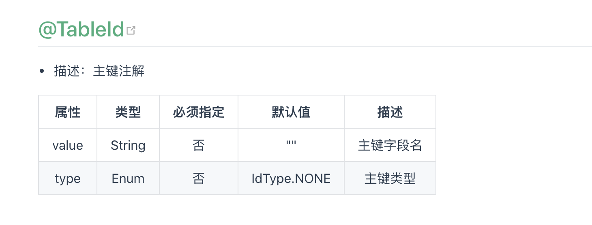
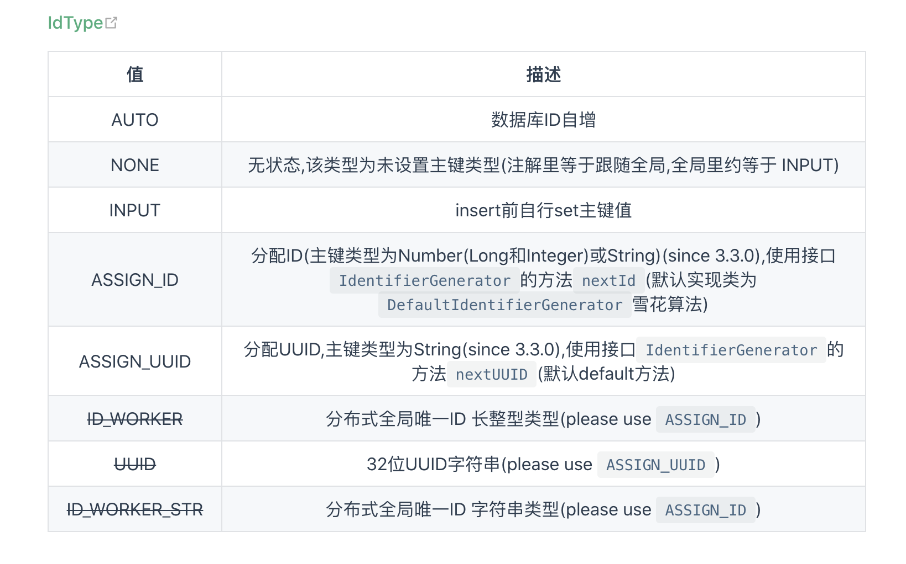

# Mybatis-plus 主键问题

## 场景分析
数据库中存在一张表，已设置主键，类型为int，并没有设置自增

## 问题展示
问题一 @TableId 设置为AUTO报错数据库没有默认值

问题二 @TableId 设置为ID_WORKER，报错超过字段的长度

## 理论分析

## 原因分析
### 针对问题一
IdWorker.Auto默认是自增的，因此数据库必须得设置为自增
不仅如此，还需要将java中的Integer设置为Long，因为默认自增会生成一个long型的

### 针对问题二
设置java中的Integer设置为Long